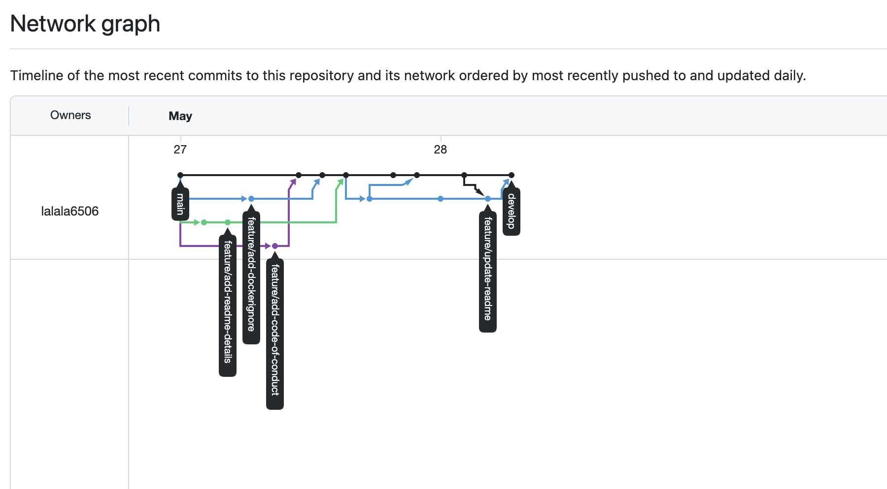
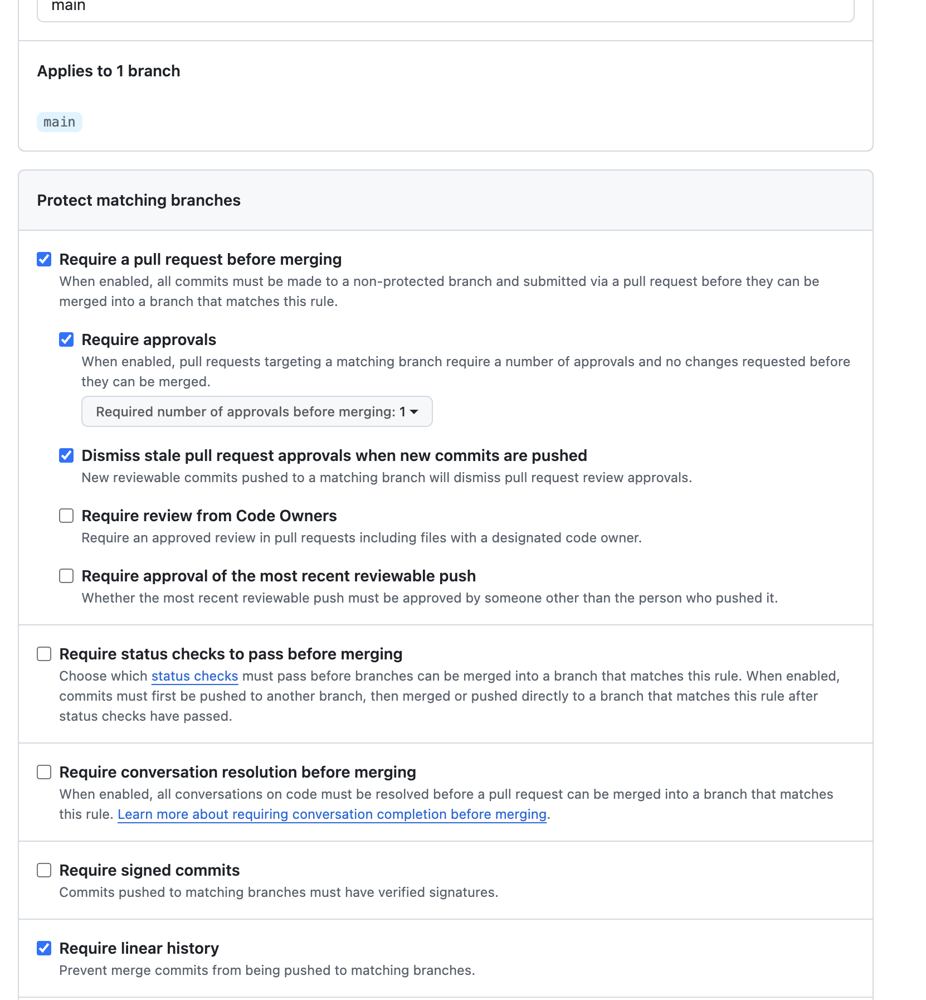
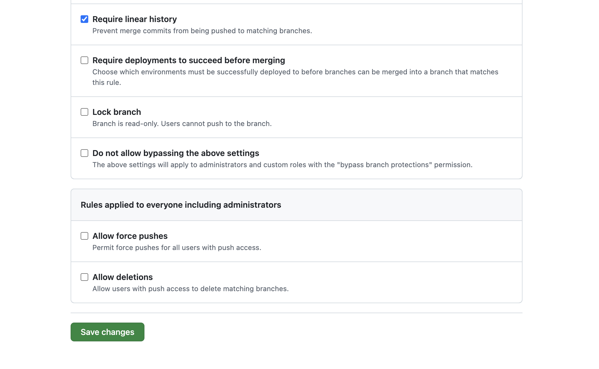

# Network Graph

# Branch Protection Rules

# Output: git log --oneline --graph

(base) chali@Chas-MacBook-Pro mlops-git-assignment-chali % git log --online --graph
fatal: unrecognized argument: --online
(base) chali@Chas-MacBook-Pro mlops-git-assignment-chali % git log --oneline --graph
* a8b940c (HEAD -> develop, origin/develop, origin/HEAD) update readme on develop branch
*   23f2c21 Merge pull request #4 from lalala6506/feature/update-readme
|\  
| * d6ce4aa update readme
* | 0ec73d2 update with student ID and date
|/  
*   3bfddb1 Merge pull request #3 from lalala6506/feature/add-readme-details
|\  
| * da6d0e4 (origin/feature/add-readme-details, feature/add-readme-details) edit small ajustment to README.md
| * 25e7716 Add proejct description to README
* |   5bbc64c Merge pull request #2 from lalala6506/feature/add-dockerignore
|\ \  
| * | d05394d (origin/feature/add-dockerignore, feature/add-dockerignore) create .dockerignore file for python project
| |/  
* |   19622e5 Merge pull request #1 from lalala6506/feature/add-code-of-conduct
|\ \  
| |/  
|/|   
| * ae42e60 (origin/feature/add-code-of-conduct, feature/add-code-of-conduct) edit code of conduct info
|/  
* e3ad02a (origin/main) Initial commit

# A brief reflection on what you found challenging about resolving merge conflicts

the challenging is to decide which version to keep. you need to manuelly resolve this conflict 